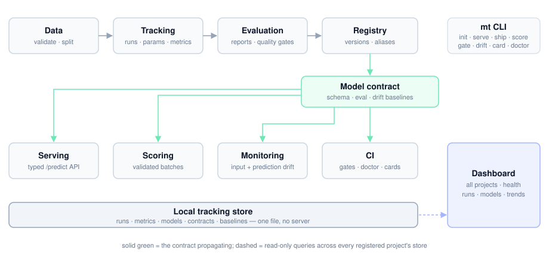
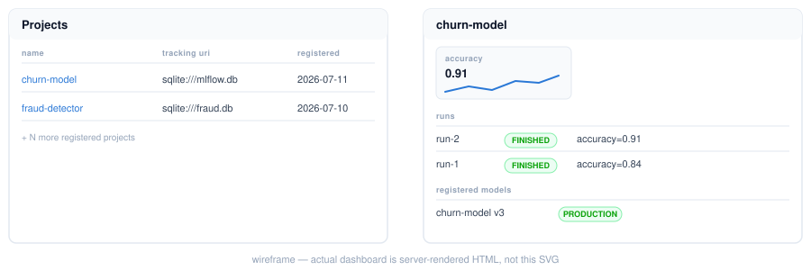

<div align="center">

# mlops-toolbox

Your model remembers its own contract — schema, evaluation, and drift baseline travel with it from training to production.

[](https://www.python.org)
[](#)
[](https://github.com/astral-sh/ruff)
[](https://mypy-lang.org)



</div>

## Why mlops-toolbox?

Every MLOps tool covers one lifecycle stage well; almost none carry context
*between* stages. That handoff gap is exactly where models break on the way
to production — the serving endpoint doesn't know the input schema, the
monitoring job doesn't have the training data, the CI pipeline doesn't know
what "good enough" was.

**The core idea: contract propagation.** When you register a model,
`mlops-toolbox` stores a contract with it — the input schema (with category
sets and value ranges) inferred from your training data, the evaluation
report it shipped with, a reference dataset, and baseline predictions.
Everything downstream consumes that contract automatically. One
`register_model()` call at training time buys you a typed serving API,
validated batch scoring, ready-to-run drift monitoring, and CI quality gates
— with zero extra configuration.

The library is **backend-agnostic by design**: you code against small stage
interfaces (`tracker()`, `model_registry()`, `drift_detector()`,
`model_server()`) and never against the tools working behind the scenes, so
any backend can be replaced without touching your code. Everything runs
local-first — one file-based store, no server, no account — and the whole
codebase is strictly typed (`mypy --strict`, pydantic everywhere).

## Key features

| Feature | What it gives you |
|---|---|
| **Model contracts** | Schema + categories + ranges + metrics + drift baseline captured once at registration, consumed everywhere downstream |
| **Typed serving** | `/predict` validates requests against the contract — wrong types or unknown categories get a 422, not a stack trace |
| **Batch scoring** | `mt score data.parquet` / `score_dataframe()` enforce the contract on the way in, append predictions on the way out |
| **Drift without baggage** | `mt drift` checks input *and prediction* drift against baselines stored at registration — no training data needed |
| **CI quality gates** | `mt gate "f1_macro>=0.85"` exits 0/1 — model quality as a failing check on a PR |
| **One-command shipping** | `mt ship` → self-contained folder (model, server, Dockerfile, pinned deps) that runs anywhere |
| **Model cards** | `mt card` renders schema, metrics, and monitoring status from what the registry already knows |
| **Lifecycle doctor** | `mt doctor` audits any project for gaps and names the exact call that fixes each one |
| **Project scaffold** | `mt init` generates a working project: contract-registered training plus a CI gate workflow |
| **Multi-project dashboard** | One local, read-only pane across all your tracking stores: runs, models, sparklines, health badges |

## Installation

Requires Python 3.11+. Pick the extras for the stages you need — the base
install stays deliberately light, and heavy backends load lazily.

```bash
pip install mlops-toolbox               # core only: pydantic, numpy, pandas
pip install "mlops-toolbox[tracking]"   # + experiment tracking
pip install "mlops-toolbox[registry]"   # + model registry (includes tracking)
pip install "mlops-toolbox[monitoring]" # + drift detection
pip install "mlops-toolbox[deploy]"     # + model serving
pip install "mlops-toolbox[dashboard]"  # + multi-project web dashboard
pip install "mlops-toolbox[cli]"        # + the `mt` command line
pip install "mlops-toolbox[all]"        # everything
```

If an extra is missing, the toolbox tells you exactly which one to install.

## Five-minute tour

Start from nothing:

```bash
pip install "mlops-toolbox[all]" scikit-learn
mt init my-model            # scaffold: train.py + CI workflow + README
cd my-model
python train.py             # train, evaluate, register — with contract
```

Everything after that is one command each:

```bash
mt doctor my-model                        # audit lifecycle completeness
mt models                                 # list models: versions, aliases, contract coverage
mt serve my-model --version production    # typed /predict + GET /contract
mt score my-model --input new_data.csv    # batch scoring, contract-enforced
mt drift my-model --input new_data.csv    # exit 1 if drift detected (cron/CI-able)
mt gate "accuracy>=0.85" --model my-model # exit 1 if quality gate fails (CI)
mt card my-model --out MODEL_CARD.md      # model card from the registry
mt ship my-model                          # self-contained deployable folder
mt projects                               # list all registered projects
```

## The Python API

The same lifecycle from code — everything constructed through
backend-agnostic factories:

```python
import mlops_toolbox as mt

# Validate and split
validation = mt.validate_dataframe(df, MyRowSchema)
split = mt.train_test_split(X, y, test_size=0.2, random_state=42)

# Wrap any model exposing predict() — no framework lock-in
model = mt.adapt(trained_model)

# Track the experiment (local file-based store, no server)
tracker = mt.tracker("sqlite:///mlops.db", experiment_name="demo")
tracker.start_run()
report = mt.ClassificationEvaluator().evaluate(split.y_test, model.predict(split.X_test))
tracker.log_metrics(report.metrics)
run = tracker.end_run()

# Register with the contract — this is the line that pays for everything below
registry = mt.model_registry("sqlite:///mlops.db")
info = registry.register_model(
    model,
    name="my-model",
    run_id=run.run_id,
    contract=mt.infer_contract(split.X_train, y=split.y_train, evaluation=report),
    reference_data=split.X_train,
)
registry.set_alias("my-model", info.version, "production")
```

Downstream, the model knows its own contract. Anywhere a version is
accepted, use a number, `"latest"`, or an alias like `"production"`:

```python
# Batch scoring with contract enforcement
scored = mt.score_dataframe(new_df, registry=registry, name="my-model")

# Drift against the stored baselines
drift = mt.check_drift(new_df, registry=registry, name="my-model")
pred_drift = mt.check_prediction_drift(scored["prediction"], registry=registry, name="my-model")

# Typed serving
server = mt.model_server()
app = server.build_app(
    registry.get_model("my-model", version="production"),
    contract=registry.get_contract("my-model", version="production"),
)
server.serve(app, port=8000)

# Quality gates for CI
assert report.check_gates(["f1_macro>=0.85", "accuracy>0.9"]).passed

# Model card
print(mt.generate_model_card(registry, "my-model"))
```

See [`examples/quickstart.py`](examples/quickstart.py) for a runnable
end-to-end script.

## Dashboard

Register any number of projects — each just a name pointing at a tracking
URI — and browse them all in one local, read-only web dashboard: runs,
registered models, metric sparklines, and per-project lifecycle health
badges backed by the same checks as `mt doctor`.

```python
mt.register_project("my-model", "sqlite:///mlops.db", tags={"team": "growth"})
mt.run_dashboard()  # http://127.0.0.1:8050
```

Or: `python -m mlops_toolbox.dashboard [--host HOST] [--port PORT]`.

<div align="center">

</div>

Project registration is core-only and stored locally in
`~/.mlops-toolbox/projects.json` (override with `MLOPS_TOOLBOX_HOME` or
`registry_path=`). The dashboard never writes to a project's store.

## Documentation

Full documentation lives in [`docs/`](docs/) and is published as a hosted
site (see `.github/workflows/docs.yml`): a getting-started guide, the
contract-propagation concept explained, per-persona guides (software
engineers moving into ML, data scientists moving into production), and a
complete CLI reference.

## Contributing

Issues and PRs are welcome. Before opening one:

```bash
uv sync --all-extras --group dev
uv run pytest
uv run ruff check .
uv run mypy src/mlops_toolbox
```

All three must pass clean — this codebase runs `mypy --strict` with zero
errors and tests against real local backends rather than mocks.

## Roadmap

Done: contract propagation, typed serving, batch scoring, input + prediction
drift with exit codes, quality gates, model cards, lifecycle doctor, project
scaffold with CI recipe, multi-project dashboard with health badges.

Next, roughly in order:

- **Dashboard depth** — drift history over time and side-by-side run comparison.
- **Framework adapters** — native torch and xgboost adapters (today they work
  through the generic `adapt()` duck-typing).
- **Second backends per stage** — proving the swappable-interface design with
  an alternative tracking and deployment backend.
- **Richer contracts** — user-declared (not just inferred) constraints, and
  contract diffing between model versions.
